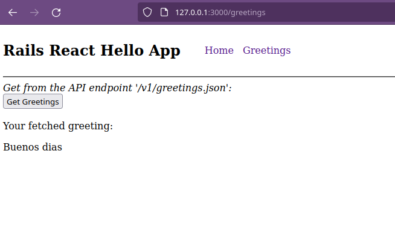

# Rails-React-Hello Website

# Preview

  

# Table of Contents

- [Description](#description)
- [Built With](#built-with)
- [Setup](#setup)
  - [Clone Repo](#clone-repo)
  - [Prerequisites](#prerequisites)
  - [Install Rails](#install-rails)
- [Getting Started](#getting-started)
  - [System Dependencies](#system-dependencies)
  - [Database Initialization](#database-initialization)
- [Usage](#usage)
  - [Start Server](#start-server)
- [How To Contribute?](#how-to-contribute)
- [Collaborators](#collaborators)
- [Show Your Support](#how-your-support)
- [Acknowledgments](#acknowledgments)
- [License](#license)

## Description
> Mobile application that allows users to organize their finances by recording transactions and assigning them categories.

## Built With

- Major languages: Ruby, JavaScript.
- Frameworks: Ruby on Rails, React.
- Tools & Methods: PostgreSQL.

# Setup

We'll need to prepare your computer to handle Ruby on Rails, which might be a hassle, so take a deep breath and cope with me :)

If you have Rails 7 installed, you can skip to the [Getting Started](#getting-started) section

## Clone Repo

First clone this repo by running this command in your terminal:
~~~ bash
git clone https://github.com/eduardosancho/rails-react-hello.git
# wait a couple seconds for it to download
# ...
# ...
# then move into the new directory
cd rails-react-hello
~~~

## Prerequisites

The following technologies must be installed before hand in your local machine:

 - Ruby (ruby --version). Should be 3.0.1 or newer.
 - SQLite3 (sqlite3 --version)
 - Node.js (node --version)
 - Yarn (yarn --version)  

The commands in parenthesis `()` can be used to verify if they are installed and their corresponding versions.

Refer to [Section 3](https://guides.rubyonrails.org/v5.1/getting_started.html#:~:text=3%20Creating%20a%20New%20Rails%20Project) from the official [Rails Guide](https://rubyonrails.org/) for more detailed instructions on how to install these technologies.

### Install Rails
Once that's done, we can install Rails. For that, run these commands in your terminal:
~~~ bash
gem install rails
# wait a few seconds for it to download
# ...
# ...
# verify that it was installed by running
rails --version
~~~

# Getting Started
The next steps setup the playing field for you to run the app in your local machine.

## System Dependencies

We're getting there... trust me ;)

Execute this command to automatically install all the dependencies needed to view and work on this project:

~~~ bash
bundle install

#and

npm install
~~~

The full list of dependencies can be found within the [Gemfile](Gemfile) and [package.json](package.json).

This also installs PostgreSQL, which you'll need for the next step.

## Database Initialization
The following command will create the database and populate it with default data:
~~~ bash
rails db:setup
~~~ 
You can access the created databases manually via the command `rails db`.

## Usage
If you got to this point, congratulations! You now have spent 2 hours in order to toy with my app. I appreciate your effort :P

## Start Server
The following command should start a server
~~~ bash
rails s

#or

rails server -p 3000
~~~
Which you can visit by going to http://localhost:3000 in your browser.

If you want to see your changes reflected on the server, open a second terminal and run this command:
~~~ bash
./bin/webpack-dev-server
~~~

## How To Contribute?

Always remember to commit your contributions on a different branch. You can create a new one by running `git checkout -b <branchname>`.

Visit [linters folder](.github/workflows/linters.yml) to learn how to setup linters.

Then check linters locally before pushing by running:
~~~ bash
npx stylelint "**/*.{css,scss}" --fix
# ...
# ...
bundle exec rubocop -A
~~~

# That's all folks!

## Collaborators
👤 **Eduardo**

 Platform | Badge |
 --- | --- |
 **GitHub**  | [@eduardosancho](https://github.com/eduardosancho)
 **Twitter** | [@sanchitoblog](https://twitter.com/sanchitoblog)
 **LinkedIn** | [Eduardo Sancho Solano](https://www.linkedin.com/in/eduardo-sancho-solano/)

 
## Show your support

Give a ⭐️ if you like this project!

## Acknowledgments

The ideas and inspiration from this project are coming from this online school of software development:
 [**Microverse**](https://www.microverse.org/)

## 📝 License

This project is [MIT](./MIT.md) licensed.
